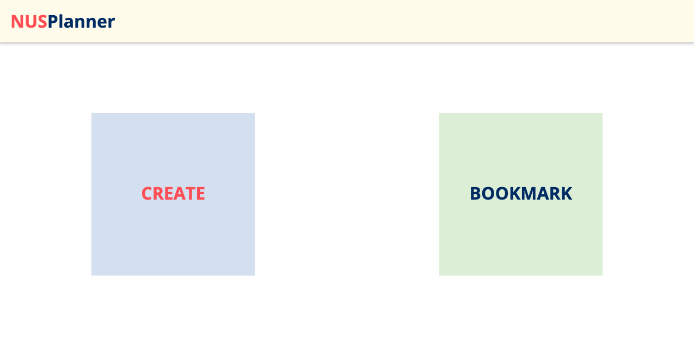

# NUSPlanner

This is the frontend code of the NUSPlanner website.
This project is a Web-based tool designed to help students create and keep track of their favourite timetables according to the modules and preferences they choose.

## Getting Started

1. Install Visual Studio Code
2. Download both front and back end codes
3. Open both codes on Visual Studio Code
4. Run commands
   `npm install`
   and
   `npm start`
   on both terminals

## Instructions on how to use NUSPlanner:

-----------------------------------------------HOME PAGE------------------------------------------------------

o Hovering over the Create flip card will reveal the instructions on how to use the CREATE page.

o Hovering over the Bookmark flip card will reveal the instructions on how to use the BOOKMARK page.

o Clicking the Create card will redirect you to the CREATE page, while clicking the Bookmark card will redirect you to the BOOKMARK page.

----------------------------------------------CREATE PAGE-----------------------------------------------------

o Select the number of modules you desire to input.

o Input the desired modules and click NEXT to be redirected the the PREFERENCE page.

---------------------------------------------PREFERENCE PAGE-------------------------------------------------

o If you wish to lock in any preferred slots, click on the drop down bar to select your preferred slots. Click CREATE to be redirected to the TIMETABLE INFO/LINK page.

----------------------------------------------TIMETABLE PAGE--------------------------------------------------

o Your timetable information will be displayed in separate boxes.

o Click FINISH CREATING AT NUSMODS to see your finished timetable at the NUSMods website. You can make any changes on NUSMods if you wish to.

o Click COPY LINK to copy the link of the generated timetable.

o Click BOOKMARK to be redirected to the BOOKMARK page.

-----------------------------------------------BOOKMARK PAGE--------------------------------------------------

o Copy the NUSMods link and paste it into the Timetable Link portion of the form. Fill in the rest of the form with the modules chosen and a name. Click SUBMIT to store your timetable in the table below.

o The SUBMIT button will be disabled if "Timetable name", "Modules taken" and "Timetable Link" are not filled up. "Timetable Link" must have the words "nusmods" to be considered valid.

## Built with

- MongoDB
- Express.js
- React.js
- Node.js

## Mayors

- Fang Hui Hui
- Lee Shu Ling

## Acknowledgement

- Udemy.com (Academind by Maximilian Schwarzmüller)
- Fang Pin Sern aka Benedict
